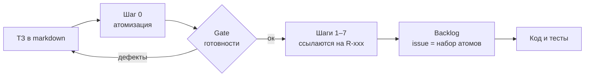

# PDA патч v1.3 — Атомизация ТЗ и сквозная трассируемость

Sep 25, 2026 · @Maxim Plyuschev

## 10.1 Что не покрыто версиями 1.1–1.2

ТЗ — единственный слой цепочки без адресов, поэтому его пересказ теряет требования молча. У неопределённостей есть U-xx, у актов A-xx, у законов INV-xx, у констант C-xx, у событий — имена в реестре. На ТЗ ссылаются разделом: «сверка с ТЗ §2.3».

*Дополнение к PDA v1.1 (05.03.2026) и патчу v1.2. Добавляет шаг 0 и раздел 10, расширяет разделы 3, 5, 7, 8, A2 и контракт агента 9.5.*

Три класса потерь, найденные на Прогресс-боте сверкой ТЗ с `docs/pda` и `docs/issues`:

| Класс потери | Пример | Почему CI не поймал |
| --- | --- | --- |
| Список сжат пересказом | §2.3 перечисляет четыре сигнала застоя из GitHub. Реализован один — красный CI (A-12, `github.checks_failed`). PR в review, issue без активности и issue без ветки упомянуты только прозой в C-1. | S-7 сверяет INV-xx с тестами, а у сигналов не было ID. |
| Требование выпало целиком | Коммиты (§3, §5.2 «Последний commit», §5.6), git-ветки, релизы, «issue закрыт как not planned → предложить отмену» (§3.1), кнопка НАСТРОЙКИ (§5). | Отсутствию нечему упасть. |
| «Забыто» неотличимо от «решено» | Динамика отложена явно (§12, V2). Релизы и Настройки не отложены и не отвергнуты — их просто нет. | Решение «не делаем» и забывчивость выглядят одинаково: пусто. |

**Тезис патча:** требование без адреса — пожелание. На него нельзя сослаться и нельзя проверить, что оно дошло до кода. Это правило раздела 8, применённое на шаг раньше PDA.

## 10.2 Новые понятия и принципы

Патч вводит три понятия и пять принципов; всё остальное в нём из них выводится.

| Термин | Смысл | Артефакт |
| --- | --- | --- |
| **Атом ТЗ** | Фрагмент ТЗ, о котором можно отдельно ответить: сделано, не сделано или решили не делать. | Якорь `{R-xxx}` в тексте ТЗ + запись в реестре |
| **Трасса** | Цепочка ссылок атом → элемент PDA → issue → тест. | Вычисляется скриптом, руками не ведётся |
| **Инвариант трассировки** (TR-xx) | То, что всегда истинно в цепочке документов. | Проверка в CI |

| Принцип | Что из него следует |
| --- | --- |
| Адрес раньше смысла | ID ставится до интерпретации. PDA ссылается на адрес, а не пересказывает текст. |
| Покрытие вычисляется, отказ записывается | «Покрыто» никто не отмечает: покрыто то, на что сослался нижний слой. Руками пишется только решение не делать — с причиной. |
| Ссылка только на соседний слой | PDA ссылается на атомы, issue — на атомы и PDA, тест — на INV. Сквозная трасса собирается скриптом как join. |
| Агент режет, скрипт считает, человек решает | Нарезку и типизацию делает агент. Полноту проверяет детерминированный скрипт. Отказы и неясности закрывает архитектор. |
| ТЗ пишется свободно, проверяется строго | Шаблона ТЗ нет. Требования к ТЗ — это классы дефектов, которые находит шаг 0 (10.10). |

## 10.3 Шаг 0. Атомизация ТЗ

Шаг 0 стоит перед картой неопределённости и даёт каждому фрагменту ТЗ адрес, вид и релиз. Шаг 1 не начинается, пока ТЗ не прошло gate готовности (10.10).



Дефекты возвращаются в ТЗ правкой текста, а не записью в реестре.

- **Цель:** адрес, вид и релиз для каждого фрагмента ТЗ; дефекты ТЗ — до проектирования, а не после сборки.
- **Вход:** ТЗ в markdown в репозитории. ТЗ перестаёт быть архивным файлом: теперь это корень трассы.
- **Выход:** ТЗ с якорями, реестр `contracts/tz-registry.yaml`, лок `contracts/tz.lock`, отчёт о готовности ТЗ.
- **Порядок:** один раздел ТЗ за проход агента, после каждого прохода — TR-1…TR-3. Всё ТЗ одним проходом не режется: к шагу 0 применяется тот же закон размера, что и к задачам (10.11).
- **Роли:** агент режет и типизирует; скрипт проверяет полноту; архитектор закрывает `clarify` и утверждает отказы.

## 10.4 Атом: адрес и вид

Атом получает сквозной номер `R-001`, `R-002`… и вид, который определяет, куда он обязан лечь в PDA. Если ответ «сделано» может различаться для двух частей фрагмента — это два атома.

**Адрес.** Номер не зависит от раздела ТЗ и никогда не переиспользуется. Вариант `T-2.3.1` отвергнут: вставка раздела сдвигает номера и рвёт все ссылки вниз по цепочке. Раздел скрипт вычисляет по положению якоря; удалённый атом остаётся в реестре со статусом `withdrawn`.

**Вид.**

| Вид | Что это | Признак в тексте | Обязан лечь в PDA | Доказательство в коде |
| --- | --- | --- | --- | --- |
| `rule` | всегда истинно или запрещено | «только», «не», «без X не» | INV-xx (04) или constraint (03) | тест INV-xx (S-7) |
| `act` | действие человека | «пользователь / lead делает» | A-xx (02) | событие + сценарный тест |
| `reaction` | действие системы на условие | «когда / если X — бот делает Y» | событие (06) + автоматический A-xx | событие в реестре (S-3) + тест |
| `entity` | сущность или поле | объект, поле схемы данных | узел или поле Domain Graph (03) | миграция, constraint |
| `view` | что показывается и в каком виде | экран, карточка, отчёт, поле макета | проекция и экран (07) | рендер-тест или отметка на приёмке |
| `integration` | внешний источник или канал | GitHub, webhook, API | Blueprint (07) + события источника | контракт адаптера |
| `tech` | техническое решение из ТЗ | «через GitHub App», «PostgreSQL» | Blueprint (07), решения пакета | конфиг, зависимости |
| `metric` | измеримый критерий | «за 10–20 секунд», доли | Observability (08) | метрика на дашборде |
| `scope` | состав релиза | MVP, V2, «не входит» | атрибут `scope` других атомов | — |

Текст без требований — обоснование, пояснение — помечается якорем `{ctx}`: без ID и без трассы.

**Правило вида:** ссылка от элемента чужого вида атом не покрывает. `reaction`, на который ссылается только константа, остаётся непокрытым (10.7).

Колонка «доказательство» задаёт уровень надёжности. Тест и реестр — механизм; отметка на приёмке — договорённость уровня 9.5.

## 10.5 Правила нарезки

Нарезка детерминирована: правила применяются по порядку, «по смыслу» не режется ничего.

1. **Блок — единица покрытия.** Каждый абзац, пункт списка, строка цитаты и строка таблицы начинается с якоря. Список из четырёх пунктов требует четырёх якорей — под одну метку он не уходит.
2. **Одно утверждение — один атом.** Второй якорь внутри блока ставится там, где начинается второе независимое утверждение.
3. **Перечисление в строку раскрывается в список.** «repository, branches, commits…» переписывается списком, дальше работает правило 1. Меняется разметка, не смысл.
4. **Макет — спецификация формата.** Каждое поле макета экрана или отчёта — атом `view`. Конкретные значения («42%», «Андрей») — иллюстрация.
5. **Отрицание, умолчание, граничный случай — отдельные атомы.** «Бот не изменяет объекты GitHub», «по умолчанию normal», «если данных нет — блок не печатается».
6. **Обоснование не режется.** «Потому что…», «чтобы…» — один `{ctx}` на фразу.
7. **Повтор — отдельный атом.** Одно требование в двух местах ТЗ — два атома, второй с решением `same_as`. Один ID не стоит на двух блоках.
8. **Числа не выносятся.** Число остаётся внутри атома; скрипт находит его сам и требует константу (TR-6).

Контрольный пример — начало §2.3 Прогресс-бота. После шага 0 там 11 атомов вместо одной ссылки «§2.3»; четыре сигнала застоя получают четыре адреса по правилу 1.

```markdown
{R-040} Задача, не отмеченная за два дня, уходит в `BLOCKED`, {R-041} и бот пишет исполнителю в личку: «AI-12 не двигается 3-й день, что мешает?» — {R-042} с кнопкой «нет блокера». {R-043} Строка ответа становится причиной блокера, {R-044} кнопка возвращает задачу в `IN_PROGRESS`. {R-045} По одной задаче бот переспрашивает не чаще раза в 2 дня.

{R-046} Отдельно бот показывает факты застоя из GitHub — даже если причину никто не назвал:

- {R-047} PR открыт, а CI красный;
- {R-048} PR висит в review без движения дольше 2 дней;
- {R-049} по связанному issue нет активности дольше 2 дней;
- {R-050} у issue нет ни ветки, ни PR дольше 2 дней.
```

## 10.6 ТЗ с якорями, реестр и лок

Каждый факт об атоме хранится в одном месте: текст — в ТЗ, свойства — в реестре, отпечаток текста — в локе.

| Файл | Что хранит | Кто пишет |
| --- | --- | --- |
| ТЗ, например `docs/tz.md` | текст требований, якоря `{R-xxx}` и `{ctx}` | автор ТЗ; якоря ставит агент на шаге 0 |
| `contracts/tz-registry.yaml` | вид, `scope`, решение, глоссарий | агент; решения утверждает архитектор |
| `contracts/tz.lock` | хэш текста каждого атома | генерирует `tz:lock`, руками не правится |

Якорь видимый. HTML-комментарий чище, но его теряют конвертеры и агенты при переписывании абзаца, а невидимое нельзя сохранить сознательно.

Реестр не копирует текст атома: две копии разойдутся с первой правки. Пример записей:

```yaml
# contracts/tz-registry.yaml
source: docs/tz.md
glossary:
  ветка: topic Telegram          # git-ветка пишется «branch» (D-4)
atoms:
  R-048:
    kind: reaction
    scope: R-305                 # MVP п.5: экраны, в том числе «Блокеры»
  R-121:
    kind: view
    scope: none
    decision: clarify
    note: кнопка НАСТРОЙКИ в меню §5; нет ни в MVP, ни в V2/V3
  R-140:
    kind: integration
    scope: R-309                 # MVP п.9: webhooks
    decision: rejected           # пример записи решения
    note: ни один экран MVP не показывает релизы
  R-305:
    kind: scope
    release: mvp
```

Релиз атома не назначается, а доказывается: `scope` указывает на пункт объёма работ из ТЗ. Нет такого пункта — атом получает `clarify`, а не «наверное, MVP».

```text
# contracts/tz.lock — генерируется, руками не правится
R-047 5c19e0b2
R-048 9f2c41aa
R-049 1a7e0c3d
```

Изменение реестра и лока — отдельный коммит, не смешанный с реализацией, как новое событие в Event Registry (9.4).

## 10.7 Статусы атома: покрытие вычисляется, отказ записывается

Статус «покрыто» не пишет никто — его вычисляет скрипт по ссылкам нижних слоёв. Руками записывается только решение не покрывать, и принимает его архитектор.

| Статус | Как получается | Кто ставит |
| --- | --- | --- |
| `covered` | есть ссылка от элемента PDA нужного вида (10.4) | вычисляется |
| `partial` | ссылки есть, но только от элементов чужого вида | вычисляется |
| `orphan` | ни ссылки, ни решения | вычисляется |
| `deferred` | `decision: deferred`, `scope` указывает на V2/V3 | архитектор |
| `rejected` | `decision: rejected` + причина | архитектор |
| `same_as` | повтор другого атома | агент, проверяет архитектор |
| `clarify` | ТЗ неясно или противоречит себе | агент поднимает, архитектор закрывает правкой ТЗ |

`orphan` и `partial` — это «забыто», ставшее видимым. Их нельзя объявить, их можно только устранить: ссылкой нужного вида или решением.

Ожидаемый результат ретрофита для §2.3 (ссылки взяты из текущего пакета PDA):

| Атом | Вид | Ссылки в PDA сейчас | Статус |
| --- | --- | --- | --- |
| R-040 | reaction | A-13, C-1, INV-13, `blocker.detected` | covered |
| R-043 | act | A-4, `blocker.declared` | covered |
| R-045 | rule | только C-2 | partial |
| R-047 | reaction | A-12, `github.checks_failed` | covered |
| R-048 | reaction | только C-1 | partial |
| R-049 | reaction | только C-1 | partial |
| R-050 | reaction | только C-1; данных о git-ветках нет | partial |

R-048…R-050 — известная потеря. R-045 вручную не находили: частоту переспроса держит число C-2, а инварианта с тестом у правила нет. Правило вида находит больше, и часть находок закрывается решением, а не кодом.

## 10.8 Цепочка трассировки

Каждый слой ссылается только на соседний слой выше; сквозную трассу собирает скрипт.

| Слой | Ссылается на | Где стоит ссылка |
| --- | --- | --- |
| Элементы PDA: U, A, INV, C, проекции, метрики | атомы R-xxx | колонка «Из ТЗ» в таблицах 01–08 |
| События | атомы R-xxx | поле `realizes` в `event-registry.yaml` |
| Issue | атомы R-xxx и элементы PDA | раздел «Атомы ТЗ» — он же чек-лист приёмки |
| Тест | INV-xx, имя события | название теста (S-7) |
| PR | issue и закрытые атомы | `Closes #N` + список атомов |

ID атомов в код приложения не пишутся: второй путь трассы расходится с первым. Исключение — название рендер-теста для атома `view`, потому что у поля экрана нет своего ID в PDA.

Пример вывода `tz:trace`:

```text
R-040  §2.3  covered
  «Задача, не отмеченная за два дня, уходит в BLOCKED»
  → A-13, C-1, INV-13, blocker.detected
  → #9, #19
  → tests/invariants/INV-13.test.ts

R-048  §2.3  partial
  «PR висит в review без движения дольше 2 дней»
  → C-1 (константа не покрывает вид reaction)
  → —
```

Текст атома скрипт берёт из ТЗ по якорю: копии нет нигде.

## 10.9 Инварианты трассировки

Девять проверок превращают метки в механизм; метки без проверок — пожелание (раздел 8). Механизм — один скрипт `scripts/tz-check.ts` с командами `tz:check`, `tz:trace`, `tz:impact`, `tz:lock`.

| ID | Инвариант | Что ломается без него | Механизм | Режим |
| --- | --- | --- | --- | --- |
| TR-1 | Каждый блок ТЗ начинается с якоря атома или `{ctx}` | требование без адреса выпадает молча | разбор markdown по блокам | блок на шаге 0 |
| TR-2 | ID уникальны и не переиспользуются; якоря и реестр совпадают 1:1; нет ссылок на несуществующие и `withdrawn` атомы | трасса ведёт в пустоту | сверка множеств ID | блок всегда |
| TR-3 | У атома есть `scope` на атом вида `scope` или решение `clarify` | релиз назначают на глаз, забытое маскируется под MVP | проверка ссылки | блок на gate |
| TR-4 | Среди атомов MVP нет `orphan` и `partial` | требование теряется между ТЗ и PDA | покрытие по ссылкам с учётом вида (10.4) | отчёт на шагах 1–7, блок на выходе из PDA |
| TR-5 | Элемент PDA ссылается на атомы или помечен `derived: причина` | агент додумал правдоподобное требование, которого нет в ТЗ | обратная сверка | предупреждение → блок |
| TR-6 | Атом с числом покрыт константой C-xx или помечен `fixed` | число вписано в код в трёх местах — S-8 на слой выше | поиск чисел и числительных; `{ctx}` и макеты пропускаются | предупреждение |
| TR-7 | Покрытый атом MVP назначен issue; у закрытой issue отмечены все атомы | спроектировано, но не попало в задачу; недодача прошла приёмку | разбор тел issue через `gh` | блок при создании backlog и закрытии issue |
| TR-8 | Атомов в issue не больше `MAX_ATOMS_PER_STEP` | шаг больше мощности исполнителя | счётчик по issue | блок при создании backlog |
| TR-9 | Изменённый текст атома (хэш ≠ лок) пересматривается до обновления лока | ТЗ поменяли, код живёт по старому | `tz:impact` по диффу ТЗ | блок в CI до `tz:lock` |

Правило внесения то же, что в 9.3: TR принимается только вместе с работающей проверкой. `derived` в TR-5 легален для решений архитектуры — INV-16 (журнал только дополняется) или S-xx в ТЗ не записаны и не должны.

**Предел механизма.** TR-1 гарантирует, что без адреса не осталось ничего, но не гарантирует, что адрес поставлен верно. Требование под `{ctx}` или два утверждения под одним якорем проходят проверку. Эвристики `tz:check` сужают этот риск предупреждениями: модальные слова и числа в `{ctx}`, два сказуемых в одном атоме, три и больше однородных элемента через запятую. Остаток закрывает ревью отчёта о готовности.

## 10.10 Требования к ТЗ

К ТЗ предъявляется одно требование: пройти gate шага 0 без блокирующих дефектов. Шаблона нет; дефекты находит атомизация.

| Код | Дефект | Как находится | Пример из Прогресс-бота | Блокирует gate |
| --- | --- | --- | --- | --- |
| D-1 | Нет релиза: атом не входит ни в один пункт объёма работ | TR-3 | кнопка НАСТРОЙКИ (§5): нет ни в MVP, ни в V2, ни в V3 | да |
| D-2 | Данные без источника: поле показывается, но никто его не заполняет | у атома `entity` или `view` нет атома `act`, `reaction` или `integration`, который его пишет | `progress` задачи (§4): полоса «если заполнено», кто заполняет — не сказано. «Дата начала» и «зависимости» этапа (§2.1): в схеме `stages` (§9) таких полей нет | да |
| D-3 | Перечисление в строку или открытое («и т.д.») | эвристика TR-1 | §3: одиннадцать источников GitHub одной фразой; ветки, коммиты и релизы до PDA не дошли | нет, чинится разметкой на шаге 0 |
| D-4 | Одно слово — два смысла | глоссарий в реестре: термин → одно значение | «ветка» — topic Telegram (§2.4, §6, §7.4) и git-ветка (§2.3); коллизия перешла в PDA (03 и 05) | да |
| D-5 | Противоречие или неоднозначность | агент поднимает `clarify` | у каждого `member` своя ветка (§2.4), но список дня один на проект и дату «в ветке ответственного» (§6, §9). Чья это ветка? | да |
| D-6 | Непроверяемая формулировка | `metric` или `view` без наблюдаемого критерия | «удобно», «быстро»; в этом ТЗ критерий §13 измерим — 10–20 секунд | да |

**Gate готовности ТЗ к шагу 1:**

- TR-1…TR-3 зелёные;
- нет открытых D-1, а в атомах MVP нет D-2, D-4, D-5, D-6;
- D-3 исправлены разметкой.

Дефект закрывается правкой ТЗ, а не записью в реестре: реестр описывает ТЗ, а не заменяет его. Это правило пакета PDA — расхождение фиксируется правкой ТЗ.

## 10.11 Атом как мера шага

Атомизация даёт единицу размера задачи, которой не было: число атомов в issue. Вместе с ней недодача впервые становится измеримой.

**Метрика.** `underdelivery_rate` — доля атомов issue, не сданных с первого прохода. Считается на приёмке по чек-листу «Атомы ТЗ»: неотмеченный пункт и есть недодача.

**Константа** по образцу 5.4:

| Поле | Значение |
| --- | --- |
| Название | `MAX_ATOMS_PER_STEP` |
| Тип | лимит |
| Зачем нужна | держит шаг в пределах, которые исполнитель реализует целиком |
| Значение по умолчанию | из ретрофита (10.14); без данных — 10, экспертно |
| Допустимый диапазон | 5–25 |
| Как калибруем | `underdelivery_rate` по размеру issue: порог — размер, после которого доля недоданных атомов растёт |
| Риск, если завышена | недодача возвращается: шаг снова больше мощности агента |
| Риск, если занижена | шагов много, растёт стоимость сшивки и приёмки |
| Владелец | архитектор |

Шаг сверх лимита режется по атомам, а не по слоям. Атом может входить в две issue — доменную и Telegram; он сдан, когда закрыты обе.

## 10.12 Изменение ТЗ после старта

Правка текста атома видна в CI до того, как код разойдётся с ТЗ.

1. Автор правит текст ТЗ; якоря не трогает.
2. `tz:check` сравнивает хэши с локом: TR-9 красный, в отчёте — изменённые атомы.
3. `tz:impact` печатает всё, что стоит на трассе: элементы PDA, issues, тесты.
4. Архитектор решает по каждому атому: уточнение (ID прежний, трасса пересматривается) или новый смысл (старый `withdrawn`, новый ID).
5. `tz:lock` обновляет лок отдельным коммитом.

Новый текст без якоря ломает TR-1: требование не попадает в ТЗ без адреса. Удалённый якорь ломает TR-2: атом переводится в `withdrawn`, его ссылки вниз всплывают как висячие.

Пример: «два дня» → «три дня» в R-040. `tz:impact` показывает C-1, A-13, INV-13, #19. Число держит константа, поэтому правка — одна строка конфига, а не новая фича.

## 10.13 Правки существующих артефактов

Патч добавляет колонку «Из ТЗ» в канвасы и раздел «Атомы ТЗ» в issue; остальное в PDA не меняется.

| Артефакт | Правка |
| --- | --- |
| 3.1 Роли | Архитектор утверждает решения по атомам; агент их только предлагает. |
| 5.1 Uncertainty Map | Колонка «Из ТЗ»: атомы, из которых выведена неопределённость. |
| 5.2 Domain Graph | Колонка «Из ТЗ» у сущностей и связей. Поля-атомы `entity` сверяются по имени поля, без ручных ссылок. |
| 5.3 Invariant Spec Sheet | Строка «Из ТЗ» или «derived: причина». |
| 5.4 Constant Card | Строка «Из ТЗ»: все атомы, чьи числа держит константа. |
| 5.5 Event Card, реестр 9.4 | Поле `realizes: [R-…]`. |
| Шаблон issue | Раздел «Атомы ТЗ» заменяет «сверку с ТЗ §N»; DoD — все атомы отмечены. |
| 9.5 Agent Rules File | Запреты: менять и удалять якоря; реализовывать то, чего нет в атомах issue; достраивать пробел ТЗ — пробел поднимается как `clarify`. PR перечисляет закрытые атомы. |
| Чек-лист 7.1 | ТЗ прошло gate шага 0. |
| Чек-лист 7.2 | TR-1…TR-9 работают в CI. |
| Чек-лист 7.3 | `underdelivery_rate` и число `orphan` на дашборде устойчивости. |

Шаблон issue после патча:

```markdown
## Атомы ТЗ
- [ ] R-047 — PR открыт, CI красный → факт застоя на экране Блокеры
- [ ] R-048 — PR в review без движения дольше C-1
- [ ] R-049 — issue без активности дольше C-1
- [ ] R-050 — issue без ветки и PR дольше C-1

## DoD
- все атомы отмечены; неотмеченный — новая issue или clarify, не «почти готово»
- тесты INV-xx зелёные, CI не ослаблен
```

**Антипаттерны, к разделу 8:**

| Антипаттерн | Почему это ломает систему |
| --- | --- |
| «Сверка с ТЗ §N» | Ссылка на раздел проверяет всё и ничего: отдельный пункт выпадает без следа. |
| Нарезка по смыслу | Разрез зависит от того, кто режет; одно ТЗ даёт разные атомы и разную полноту. |
| Отказ молчанием | «Не делаем» без записи неотличимо от «забыли»; через месяц не помнит никто. |
| Метки без проверки | Реестр расходится с ТЗ с первой правки, и трасса убедительно врёт. |

**Метрики, к A2, слой «Трассировка»:** trace coverage — доля атомов MVP со статусом `covered`; число `orphan` и `partial`; derived ratio — доля элементов PDA без атомов; `underdelivery_rate`; ТЗ churn — изменённые атомы за период.

## 10.14 Ретрофит и приёмочный тест патча

Патч принят, если ретрофит на Прогресс-боте сам находит потери, уже найденные вручную. Не нашёл — правил нарезки недостаточно, и патч дорабатывается до того, как применяется к новому ТЗ.

**Ретрофит** — для проекта, где PDA и backlog уже есть:

1. Шаг 0 по ТЗ, по разделу за проход.
2. «Из ТЗ» в таблицах 01–08 и `realizes` в реестре событий — по файлу за проход.
3. Атомы в разделы «Атомы ТЗ» 30 issues, из них 26 закрытых.
4. TR-1…TR-8 в режиме отчёта.
5. По каждому `orphan` и `partial` — решение или новая issue.

**Что ретрофит обязан найти сам:**

| Потеря | Где в ТЗ | Сейчас в PDA и backlog |
| --- | --- | --- |
| 3 из 4 сигналов застоя без детектора | §2.3 | только упоминание прозой в C-1 |
| коммиты: webhook `push`, «Последний commit», последние коммиты | §3, §5.2, §5.6 | следа нет |
| git-ветки как данные | §3, §2.3 | следа нет; «ветка» в PDA — topic |
| релизы | §3 | следа нет, решения нет |
| «issue закрыт как not planned → предложить отмену» | §3.1 | следа нет |
| кнопка НАСТРОЙКИ | §5 | следа нет, релиза нет |

Сверено поиском по `docs/pda` и `docs/issues`. Код не проверялся: ретрофит сверит и его.

**Второй выход — калибровка.** Число атомов в каждой из 26 закрытых issues плюс отметка, где была недодача, дают первое значение `MAX_ATOMS_PER_STEP`.

**Цена.** В ТЗ Прогресс-бота 161 блок без заголовков, около 200 фрагментов и 101 поле в схеме §9. Ожидаемо 250–400 атомов и 1,5–2,5 тыс. строк реестра. Руками это не ведётся: агент режет, скрипт проверяет.

## 10.15 Что осознанно не делается

Патч не вводит ничего, что пришлось бы вести руками параллельно с ТЗ и кодом.

| Что | Почему |
| --- | --- |
| Матрица трассировки, которую ведут руками | Трасса вычисляется из ссылок соседних слоёв; ручная матрица расходится с первого коммита. |
| ID атомов в коде приложения | Второй путь трассы расходится с первым. Исключение — название рендер-теста для `view`. |
| Шаблон ТЗ | ТЗ пишется прозой; требования к нему — классы дефектов 10.10. |
| Номер раздела в ID | Перестройка ТЗ рвёт все ссылки вниз по цепочке. |
| Нарезка скриптом без агента | Разрез и вид — суждение. Скрипт проверяет полноту, но не режет. |
| Внешний инструмент требований (Jira, DOORS) | Всё живёт в репозитории и проверяется тем же CI, что и код. |
| Версии атомов (`R-040v2`) | Уточнение обновляет лок, новый смысл получает новый ID; третий случай не нужен. |

## 10.16 Порядок внедрения

Патч не внедряется целиком: первым идёт то, что сразу находит потери.

| Когда | Что внедрить | Режим |
| --- | --- | --- |
| Первый день | Якоря в ТЗ, реестр с видом и `scope` | TR-1…TR-3 блокирующе |
| Первый день | Отчёт `orphan` и `partial` по ретрофиту — первый список потерь | отчёт |
| Первый день | Раздел «Атомы ТЗ» в шаблоне issue | приёмка по списку |
| Первая неделя | «Из ТЗ» в канвасах, `realizes` в Event Registry | TR-4 блокирующе на выходе из PDA |
| Первая неделя | `MAX_ATOMS_PER_STEP` из ретрофита | TR-7, TR-8 блокирующе при создании backlog |
| По мере боли | Лок и `tz:impact` | TR-9 блокирующе в CI |
| По мере боли | TR-5, TR-6, метрики слоя «Трассировка» | предупреждения |

Первого дня достаточно, чтобы потери между ТЗ и PDA стали видны, а приёмка issue шла по списку, а не по впечатлению.

**Правило остановки:** строки «по мере боли» не начинаются, пока строки первого дня и недели не блокируют в CI. Метки без проверки возвращают патч в состояние пожелания.
