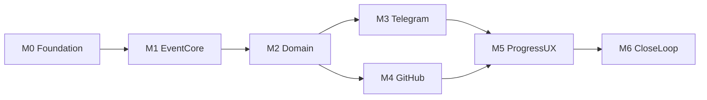

# План MVP в GitHub

Источник нарезки: [docs/10-checklists.md](docs/10-checklists.md) (шаги 1–10), объём MVP в [Прогресс-бот.md](Прогресс-бот.md) §12, контракт [AGENTS.md](AGENTS.md) (спека → домен → события → проекции → интерфейс).

После утверждения плана создать всё через `gh` в `Quantum-Insight-Lab/tg-progress-bot`. Код в этом шаге не пишется.

## Labels

Три оси — три семейства цвета, внутри оси только светлота. По цвету видно *какая* ось, по имени — *какое* значение. Дефолтные GitHub-лейблы (`bug`, `enhancement`, …) не используем и удаляем.

- `type:*` — серые (нейтральные, есть на каждой issue): `feat` `#57606a`, `chore` `#8b949e`
- `layer:*` — синие (где в коде): `domain` `#0b3d91`, `events` `#1d4ed8`, `telegram` `#2563eb`, `projections` `#60a5fa`, `ci` `#93c5fd`
- `context:*` — бирюза (какой кусок продукта): `infra` `#0b6e4f`, `projects` `#148f77`, `github` `#117a65`, `tasks` `#1abc9c`, `progress` `#48c9b0`, `reports` `#76d7c4`

`milestone:*` не нужен: этап уже в milestone.

## Milestones (этапы продукта-бота)

Порядок = зависимости. Issue из позднего milestone не стартует, пока открыты blocking-issue предыдущего.



- **M0 Foundation** — каркас, единственные механизмы, CI дня 1 (S-1, S-2, S-3, S-10)
- **M1 Event Core** — журнал, генерация типов, миграции с constraint’ами
- **M2 Domain** — `projects` и `tasks` без UI; общение только событиями
- **M3 Telegram** — акты A-1…A-10, список дня, guard доступа
- **M4 GitHub** — webhooks + сверка C-6, без мутаций (INV-09)
- **M5 Progress and UX** — процент, проекции, экраны-карточки
- **M6 Close the loop** — блокеры, ежедневный отчёт, метрики запуска

V2 (AI-формулировки, динамика как экран, weekly, несколько репозиториев на проект) в backlog не кладём.

## Шаблон тела issue

Каждое тело в одном формате — иначе агент начнёт с UI.

```
## Неопределённость
U-xx — …

## Инварианты
INV-xx (тест с этим префиксом в той же задаче)

## События
`event.type` из contracts/event-registry.yaml (новые имена — отдельный коммит в реестр, не в этой issue)

## Сделать
- …

## Не делать
- мутации GitHub; вторые клиенты БД/бота; правила в хендлере

## DoD
- тесты INV-xx зелёные
- CI не ослаблен
- сверка с ТЗ
```

В описании GitHub: `Blocked by #N` после создания (номера подставить вторым проходом).

## Issues

Зависимости указаны названиями; при создании проставить `Blocked by`.

### M0 Foundation

1. **chore: каркас TypeScript / Node 22 и зависимости одним коммитом**
   - labels: `context:infra`, `type:chore`
   - grammY, Octokit, Kysely, Vitest, ESLint — обоснование в сообщении коммита (запрет 7)
2. **ci: границы слоёв и контекстов, codegen событий, запрет Date в домене**
   - labels: `layer:ci`, `type:chore`
   - S-1, S-2, S-3, S-10 из [docs/09-structural-invariants.md](docs/09-structural-invariants.md); `npm run codegen:events` сравнивается с git
   - blocked by: #1
3. **feat: единственные механизмы config, clock, logger, db pool, DomainError**
   - labels: `context:infra`, `layer:domain`, `type:feat`
   - реестр в AGENTS.md; заготовка теста-переписи S-4
   - U-15 косвенно (нет второго пути записи); INV-16 пока только правами позже
   - blocked by: #1

### M1 Event Core

4. **feat: журнал событий emit + UNIQUE idempotency_key, только append**
   - labels: `layer:events`, `type:feat`
   - INV-08, INV-16; типы только из реестра
   - blocked by: #2, #3
5. **feat: миграции таблиц и constraint’ы домена**
   - labels: `context:infra`, `type:feat`
   - таблицы из [docs/03-domain-graph.md](docs/03-domain-graph.md); UNIQUE/FK под INV-01, INV-02, INV-06, INV-07, INV-08, INV-14
   - blocked by: #3
6. **ci: сверка INV-xx в тестах со спекой (S-7) и запрет магических чисел в domain (S-8)**
   - labels: `layer:ci`, `type:chore`
   - сначала отчёт, сразу блокирующий режим: тестов ещё 0, чекер не падает на «нет файла», падает на «ID в спеке без теста» только после появления `tests/invariants/`
   - blocked by: #2

Практичное правило для #6: чекер требует тест на ID **только если** есть `tests/invariants/` или если инвариант перечислен в issue как затронутый — иначе M1 нельзя закрыть. Лучше: чекер сканирует спеку и `tests/**/*.ts`; для M1 достаточно каркаса `tests/invariants/INV-08.test.ts` внутри issue #4. Тогда #6 blocked by #4.

### M2 Domain

7. **feat: контекст projects — участники, роли, factory guard**
   - labels: `context:projects`, `layer:domain`, `type:feat`
   - U-12; INV-12; события `project.member_added` / `removed`
   - blocked by: #4, #5
8. **feat: контекст tasks — создание, приоритет, исполнитель, переходы статуса**
   - labels: `context:tasks`, `layer:domain`, `type:feat`
   - U-1, U-4, U-8, U-9, U-10; INV-01, INV-02, INV-03, INV-15
   - события `task.created`, `prioritized`, `reassigned`, `postponed`, `cancelled`
   - `projects` не импортировать — только события
   - blocked by: #7
9. **feat: REVIEW / DONE / BLOCKED — lead-only, блокеры, симметрия**
   - labels: `context:tasks`, `layer:domain`, `type:feat`
   - INV-04, INV-05, INV-13; `task.checked|unchecked|confirmed`, `blocker.*` на уровне домена (без Telegram)
   - blocked by: #8

### M3 Telegram

10. **feat: grammY-бот, регистрация хендлеров только через factory с guard**
    - labels: `layer:telegram`, `context:projects`, `type:feat`
    - INV-12; отказ не-участнику без данных
    - blocked by: #7, #2
11. **feat: список дня — создать задачу, галочка, один список на дату**
    - labels: `layer:telegram`, `context:tasks`, `type:feat`
    - U-4, U-10; A-1, A-2; INV-06, INV-07, INV-14; C-5
    - инлайн-кнопки, не native checklist
    - blocked by: #8, #10
12. **feat: перенос незакрытых пунктов на новый день**
    - labels: `layer:telegram`, `context:tasks`, `type:feat`
    - U-11; A-14; `task.carried_over`; clock + timezone проекта
    - blocked by: #11
13. **feat: отложить в план, приоритет, переназначение, отмена, подтверждение lead**
    - labels: `layer:telegram`, `context:tasks`, `type:feat`
    - A-3, A-6, A-7, A-8, A-9; INV-04
    - blocked by: #9, #11

### M4 GitHub

14. **feat: GitHub App webhook — подпись, delivery_id, зеркало issue/PR/checks/milestone**
    - labels: `context:github`, `type:feat`
    - U-2, U-15; INV-08, INV-09; события `github.*`
    - ни одного write-метода Octokit
    - blocked by: #4, #5
15. **feat: опрос-сверка пропущенного по C-6**
    - labels: `context:github`, `type:feat`
    - не основной канал; `github_sync_lag`
    - blocked by: #14

Issue выбора issue при создании задачи (#11) читает кэш зеркала: #11 может закрыться на ручном/тестовом `issue_id`, но DoD «выбор из репозитория» требует #14. В #11 явно: минимальный путь — существующий `issue_id`; список issues из GitHub — follow-up blocked by #14. Добавить issue **11b. выбор issue из зеркала в диалоге создания** blocked by #11 и #14.

### M5 Progress and UX

16. **feat: расчёт прогресса по задачам проекта и снимок**
    - labels: `context:progress`, `layer:domain`, `type:feat`
    - U-2, U-5; INV-10, INV-11; C-3, C-4; `progress.snapshot_taken`
    - blocked by: #8
17. **feat: проекции экранов и карточка на проект**
    - labels: `layer:projections`, `layer:telegram`, `type:feat`
    - экраны Прогресс / В работе / Сделано / План / GitHub; проценты не складываются
    - U-2, U-6, U-7; S-5
    - blocked by: #13, #14, #16
18. **ci: madge circular, knip warning, проекции не пишут в events (S-5, S-6, S-9)**
    - labels: `layer:ci`, `type:chore`
    - blocked by: #17

### M6 Close the loop

19. **feat: застой STALE_DAYS, вопрос исполнителю, declare/dismiss**
    - labels: `context:tasks`, `layer:telegram`, `type:feat`
    - U-3; A-4, A-5, A-13; C-1, C-2; INV-13
    - при падении GitHub сигналы застоя не ставятся
    - blocked by: #12, #15, #9
20. **feat: экран Блокеры**
    - labels: `layer:projections`, `layer:telegram`, `type:feat`
    - два списка: declared и stale
    - blocked by: #19, #17
21. **feat: ежедневный отчёт в личку и в topic по cron**
    - labels: `context:reports`, `type:feat`
    - U-14; A-16; C-7; `report.sent`; строка «все проекты» + карточки
    - blocked by: #16, #19
22. **feat: метрики устойчивости и деградация без GitHub**
    - labels: `context:infra`, `type:feat`
    - [docs/08-observability.md](docs/08-observability.md); `coverage_gap`, `rejected_commands`
    - blocked by: #21

## Что не создавать

- weekly / динамика как экран / AI-тексты — V2
- issue «закрыть issue в GitHub из бота»
- отдельная issue на каждое из 22 событий реестра: реестр уже есть, реализация идёт пакетами выше
- GitHub Project board — достаточно milestones + `Blocked by`

## Порядок выполнения после approve

1. `gh label create` × 14
2. `gh api` milestones M0–M6
3. `gh issue create` в порядке 1→22, затем edit с `Blocked by #…`
4. Проверить, что MVP §12 закрыт: пункты 1–9 ТЗ покрыты issues 10–13 (бот+карточки+роли), 8–9+13 (задачи), 16 (прогресс+подтверждение), 17+20 (экраны), 19 (блокировка), 11–12 (список дня), 21 (отчёт), 14–15 (webhooks)
